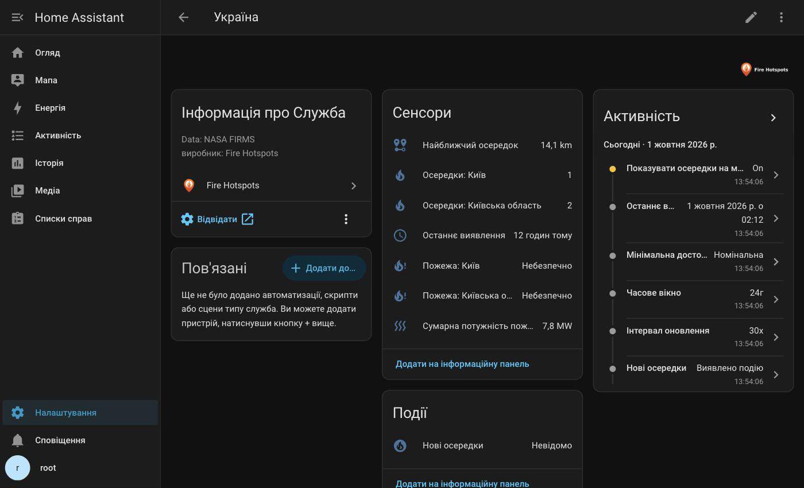
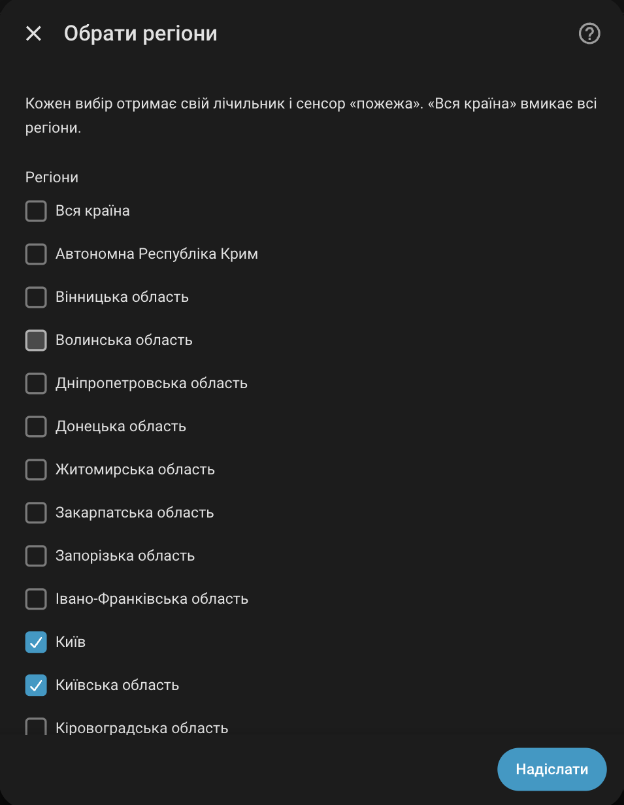
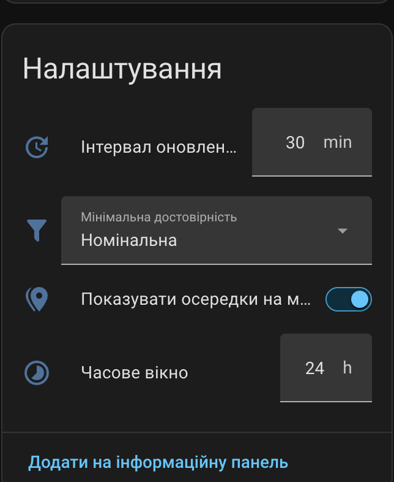
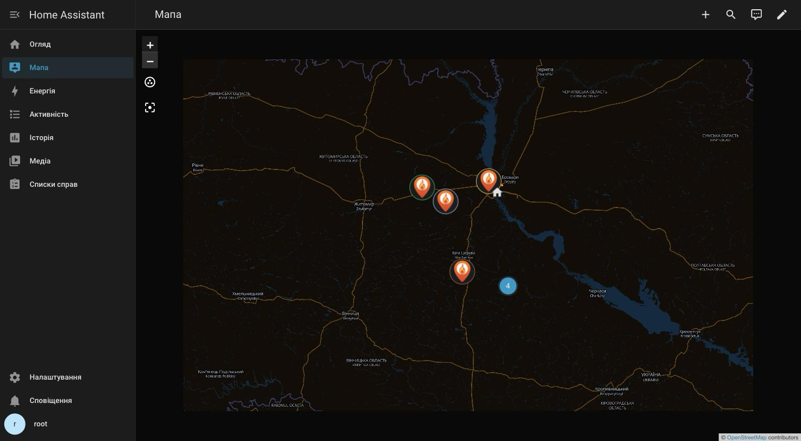

[](https://stand-with-ukraine.pp.ua/)

<br>


<br>

# 🔥 Fire Hotspots for Home Assistant

[![GitHub Release][gh-release-image]][gh-release-url]
[![GitHub Downloads][gh-downloads-image]][gh-downloads-url]
[![hacs][hacs-image]][hacs-url]
[![License][license-image]][license-url]

[Українська](./README.md) | [**English**](./readme.en.md)

> [!NOTE]
> Satellite fire hotspots for a country and its regions in Home Assistant:
> counters, "fire in region" sensors, distance to the nearest hotspot, events
> for automations and optional map markers.
> Data: [NASA FIRMS][firms] (VIIRS and MODIS). Boundaries:
> [geoBoundaries][geoboundaries].

> [!IMPORTANT]
> Independent community project, not affiliated with NASA or geoBoundaries.
> Satellites detect thermal anomalies, not confirmed fires, with a delay of up
> to a few hours. Do not rely on this integration as your only safety source.

## Entities

Per selected region (and "Whole country" if selected):

- `sensor` **Hotspots: _region_** — hotspots within the time window; attributes
  `frp_sum` (MW) and `latest_acquired`.
- `binary_sensor` (safety) **Fire: _region_** — unsafe while there is at least one.

Per country:

- `sensor` **Nearest hotspot** (km) — from Home Assistant home to the nearest monitored hotspot.
- `sensor` **Last detection** — acquisition time of the newest monitored hotspot.
- `sensor` **Total fire radiative power** (MW) — summed FRP of all monitored hotspots.
- `event` **New hotspots** — `detected` once per region with new hotspots; attributes `region`, `region_name`, `count`, `detections` (up to 50, nearest first).
- `geo_location` — one map marker per hotspot (off by default).
- `binary_sensor` (diagnostic) **Stale data** — problem when satellites have not delivered for a while; per-source timestamps in attributes.

Per watched zone (optional): **Hotspots near _zone_** (counts within the
radius, regardless of regions and country borders), **Fire near _zone_**
(safety) and **Nearest hotspot: _zone_** (km from the zone centre). New
hotspots near zones fire a separate `detected_near_zone` event type.



## Installation

The quickest way is via [HACS][hacs-url] by selecting the button below:

[![Add to HACS via My Home Assistant][hacs-install-image]][hacs-install-url]

<details>
  <summary>If the button doesn't work, add the repository manually</summary>

1. Open **HACS** → **⋮** → **Custom repositories**.
2. Paste `https://github.com/tarasholub/ha-fire-hotspots` as the repository URL.
3. Choose **Integration** as the category.
4. Find and install **Fire Hotspots**, then restart Home Assistant.

</details>

Or manually: copy `custom_components/fire_hotspots` into
`config/custom_components/` and restart Home Assistant.

## Configuration

Get a free [MAP_KEY][map-key] and select the button below:

[![Add Fire Hotspots][install-image]][install-url]

<details>
  <summary>If the button doesn't work, add the integration manually</summary>

1. Open **Settings** → **Devices & services**.
2. Select **Add integration** and search for **Fire Hotspots**.
3. Follow the setup steps.

</details>

Enter the MAP_KEY and pick a country. Boundaries are downloaded once (up to a
minute for large countries) and cached in `.storage/fire_hotspots/`. Then tick
regions and/or "Whole country". Each country is a separate integration entry;
the MAP_KEY is entered once — adding another country reuses it automatically
(you can still enter a different one).



Options (the **Configure** button): regions ("Whole country" selects every
region, and selecting every region adds "Whole country"), time window
(1–96 h, default 24),
minimum confidence (default low), satellite sources (default all four), update
interval (10–180 min, default 30), watch zones with a shared radius
(1–200 km, default 20), show on map (default off).

Besides zones, **watch points** can be added right on a map: **Configure** →
"Add a watch point" → name plus a draggable marker and radius circle (each
point has its own radius). A point gets the same entities and events as a
zone; remove points from the same menu.

The time window, confidence, interval and map toggle are also exposed as
configuration entities on the device page:



## Automations

Ready-made blueprints send mobile notifications about new hotspots — anywhere
(with a distance-from-home filter) or within a watched zone's radius:

[![Import blueprint][blueprint-image]][blueprint-url]
[![Import zone blueprint][blueprint-image]][blueprint-zone-url]

## Dashboard cards

Replace the `entity_id`s with yours (see the integration's device page):

```yaml
type: entities
title: 🔥 Fires by region
entities:
  - binary_sensor.ukraine_fire_kyiv_oblast
  - sensor.ukraine_hotspots_kyiv_oblast
```

```yaml
type: glance
entities:
  - sensor.ukraine_nearest_hotspot
  - sensor.ukraine_last_detection
  - sensor.ukraine_total_fire_radiative_power
  - binary_sensor.ukraine_stale_data
```

```yaml
type: markdown
title: 🔥 Hotspots on the map
content: >-
  
  - **{{ s.attributes.region_name }}** — {{ s.attributes.summary }}
  , {{ s.state }} km from home
  
  No hotspots 🎉
  
```

```yaml
type: conditional
conditions:
  - condition: state
    entity: binary_sensor.ukraine_fire_near_dacha
    state: "on"
card:
  type: markdown
  content: >-
    ## 🔥 Hotspots near the dacha

    Within the radius: {{ states('sensor.ukraine_hotspots_near_dacha') }},
    nearest {{ states('sensor.ukraine_nearest_hotspot_dacha') }} km away.
```

## Hotspots on the map

With "Show on map" enabled, hotspots appear on the built-in Home Assistant map
and on a map card:

```yaml
type: map
geo_location_sources:
  - fire_hotspots
auto_fit: true
```



## Counting

Polls the FIRMS Area API every 30 minutes (configurable), one request per
source; force a refresh with the `homeassistant.update_entity` action. Each
detection is assigned to a region by polygon; detections outside the country
are dropped. Defaults reproduce [SaveEcoBot][saveecobot]'s
counts (all sources, no confidence filter, no cross-satellite deduplication,
rolling 24 h). "Whole country" is the sum of its regions. Occupied territories
of Ukraine are counted within Ukraine.

Russia and Belarus are not supported as aggressor states in the war against
Ukraine.

## Removal

1. Open **Settings** → **Devices & services**.
2. Select **Fire Hotspots**.
3. Open the **⋮** menu of the country entry and select **Delete**.
4. Remove the integration from HACS and restart Home Assistant if you no
   longer want the custom component installed.

## Attribution and licenses

- Code: [MIT](LICENSE).
- Fire data: NASA FIRMS / LANCE. We acknowledge the use of data and/or imagery
  from NASA's Fire Information for Resource Management System (FIRMS), part of
  NASA's Earth Science Data and Information System (ESDIS).
- Boundaries: geoBoundaries (gbOpen), Runfola et al. (2020), *PLoS ONE* 15(4):
  e0231866. Not bundled; each installation downloads them under the license of
  the respective country dataset.
- "NASA" is used only to identify the data source and does not imply
  endorsement.

<!-- Badges -->

[gh-release-url]: https://github.com/tarasholub/ha-fire-hotspots/releases/latest
[gh-release-image]: https://img.shields.io/github/v/release/tarasholub/ha-fire-hotspots?style=flat-square
[gh-downloads-url]: https://github.com/tarasholub/ha-fire-hotspots/releases
[gh-downloads-image]: https://img.shields.io/github/downloads/tarasholub/ha-fire-hotspots/total?style=flat-square
[hacs-url]: https://github.com/hacs/integration
[hacs-image]: https://img.shields.io/badge/hacs-custom-orange.svg?style=flat-square
[license-url]: LICENSE
[license-image]: https://img.shields.io/github/license/tarasholub/ha-fire-hotspots?style=flat-square

<!-- References -->

[firms]: https://firms.modaps.eosdis.nasa.gov/
[geoboundaries]: https://www.geoboundaries.org/
[saveecobot]: https://www.saveecobot.com/analytics/fires
[map-key]: https://firms.modaps.eosdis.nasa.gov/api/map_key/
[hacs-install-url]: https://my.home-assistant.io/redirect/hacs_repository/?owner=tarasholub&repository=ha-fire-hotspots&category=integration
[hacs-install-image]: https://my.home-assistant.io/badges/hacs_repository.svg
[install-url]: https://my.home-assistant.io/redirect/config_flow_start/?domain=fire_hotspots
[install-image]: https://my.home-assistant.io/badges/config_flow_start.svg
[blueprint-url]: https://my.home-assistant.io/redirect/blueprint_import/?blueprint_url=https%3A%2F%2Fgithub.com%2Ftarasholub%2Fha-fire-hotspots%2Fblob%2Fmain%2Fblueprints%2Fautomation%2Ffire_hotspots%2Fnew_hotspots_notify.yaml
[blueprint-zone-url]: https://my.home-assistant.io/redirect/blueprint_import/?blueprint_url=https%3A%2F%2Fgithub.com%2Ftarasholub%2Fha-fire-hotspots%2Fblob%2Fmain%2Fblueprints%2Fautomation%2Ffire_hotspots%2Fzone_hotspots_notify.yaml
[blueprint-image]: https://my.home-assistant.io/badges/blueprint_import.svg
